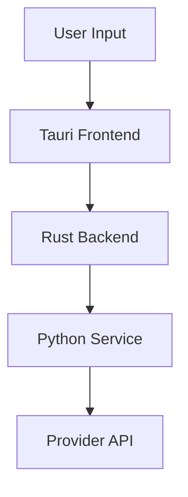

# Documentation Completeness Checklist

## ✅ Completed Documentation

### Core Architecture
- [x] ARCHITECTURE.md - System design, boundaries, decisions
- [x] SECURITY.md - Security implementation details
- [x] API_REFERENCE.md - Complete API documentation

### User Guides
- [x] GETTING_STARTED.md - Quick start for users
- [x] CONTRIBUTING.md - How to contribute
- [x] README-TAURI.md - Desktop app guide

### Developer Resources
- [x] DEVELOPMENT_WORKFLOW.md - Development process
- [x] TAURI_SETUP.md - Tauri setup guide
- [x] UI_COMPONENTS.md - UI component recommendations

### Summaries
- [x] IMPLEMENTATION_SUMMARY.md - What was built
- [x] FINAL_SUMMARY.md - Complete summary
- [x] INDEX.md - Documentation index

---

## 🚧 Missing or Incomplete Areas

### 1. Migration Guide
**Status**: Missing
**Priority**: High
**Description**: Guide for migrating from other video generation tools or upgrading between versions

**Recommended Content**:
- Migrating from Agnes CLI to VisionMachine
- Upgrading from v0.x to v1.0
- Data migration scripts
- Breaking changes documentation

**Template**:
```markdown
# Migration Guide

## From [Old Tool] to VisionMachine
1. Export your settings...
2. Convert your prompts...
3. Update API keys...

## Breaking Changes in v1.0
- API key storage changed to encrypted SQLite
- Provider configuration format updated
- Video generation pipeline refactored
```

---

### 2. Performance Guide
**Status**: Missing
**Priority**: Medium
**Description**: Optimization techniques and performance benchmarks

**Recommended Content**:
- Hardware requirements by use case
- Optimal shot count for different durations
- Memory usage profiles
- GPU acceleration (future)
- Benchmark results

**Template**:
```markdown
# Performance Guide

## Hardware Requirements
| Use Case | CPU | RAM | Storage | GPU |
|----------|-----|-----|---------|-----|
| Basic (30s) | 4 cores | 8GB | 500MB | Optional |
| Advanced (60s) | 8 cores | 16GB | 1GB | Recommended |

## Optimization Tips
- Reduce shot count for faster generation
- Use 720p for preview, 1080p for final
- Enable caching for repeated prompts
```

---

### 3. Troubleshooting FAQ
**Status**: Partially covered in README-TAURI.md
**Priority**: Medium
**Description**: Comprehensive FAQ covering common issues

**Recommended Additions**:
- Provider connection errors
- Video generation failures
- Key encryption issues
- Performance problems
- Platform-specific issues (Windows/macOS/Linux)

**Template**:
```markdown
# Troubleshooting FAQ

## Q: "Provider connection failed"
**A:** Check your internet connection and verify API key is valid...

## Q: "Video generation times out"
**A:** This usually happens with long videos. Try reducing duration...
```

---

### 4. Release Notes Template
**Status**: Missing
**Priority**: Low
**Description**: Standard template for documenting releases

**Recommended Content**:
- Version numbering scheme
- Changelog format
- Release checklist
- Announcements template

**Template**:
```markdown
# Release v[X.Y.Z]

## What's New
- Feature 1
- Feature 2

## Bug Fixes
- Fix 1
- Fix 2

## Known Issues
- Issue 1

## Upgrade Instructions
Steps to upgrade from previous version
```

---

### 5. Security Audit Report
**Status**: Missing
**Priority**: High
**Description**: Independent security review and recommendations

**Recommended Content**:
- Threat model
- Encryption implementation review
- Dependency vulnerability scan
- Security recommendations
- Audit date and reviewer

**Template**:
```markdown
# Security Audit Report

## Executive Summary
Brief overview of security posture

## Findings
### Critical
- Finding description and recommendation

### Medium
- ...

### Low
- ...

## Recommendations
Prioritized list of improvements
```

---

### 6. API Versioning Strategy
**Status**: Missing
**Priority**: Medium
**Description**: How APIs will be versioned and deprecated

**Recommended Content**:
- Versioning scheme (URL path, header, query param)
- Deprecation policy
- Migration path for API consumers
- Support timeline

**Template**:
```markdown
# API Versioning Strategy

## Version Format
v{major}.{minor} - e.g., v1, v2

## Deprecation Policy
- Major versions: 12 months support
- Minor versions: 6 months support
- Deprecated endpoints return warnings
```

---

### 7. Testing Documentation
**Status**: Partially in DEVELOPMENT_WORKFLOW.md
**Priority**: Medium
**Description**: Comprehensive testing strategy

**Recommended Additions**:
- Test pyramid diagram
- CI/CD pipeline details
- Test environment setup
- Mock services documentation
- Performance testing guidelines

---

### 8. Deployment Runbook
**Status**: Missing
**Priority**: Medium
**Description**: Step-by-step deployment procedures

**Recommended Content**:
- Pre-deployment checks
- Deployment commands
- Rollback procedures
- Post-deployment verification
- Monitoring setup

**Template**:
```markdown
# Deployment Runbook

## Pre-Deployment
- [ ] Run test suite
- [ ] Verify build artifacts
- [ ] Check environment variables

## Deployment Steps
1. Build production binary
2. Upload to distribution channel
3. Notify users
4. Monitor error rates
```

---

### 9. Glossary
**Status**: Missing
**Priority**: Low
**Description**: Terms and definitions

**Recommended Terms**:
- Provider (Agnes, OpenAI-compatible)
- Shot (individual video clip)
- Chaining (combining multiple shots)
- IPC (Inter-Process Communication)
- Fernet (encryption algorithm)
- PBKDF2 (key derivation function)

---

### 10. Visual Diagrams
**Status**: Missing
**Priority**: Medium
**Description**: Architecture diagrams, flowcharts, sequence diagrams

**Recommended Diagrams**:
1. System architecture diagram
2. Request flow diagram
3. Data flow diagram
4. Provider switching sequence diagram
5. Deployment topology

**Tools**: Mermaid.js (can be included in Markdown)


---

## 📊 Documentation Health Metrics

| Metric | Current | Target | Status |
|--------|---------|--------|--------|
| Total docs | 9 | 12 | ⚠️ 75% |
| Code coverage docs | 35 tests | All features | ✅ |
| API examples | Multiple | All endpoints | ✅ |
| Troubleshooting | Partial | Complete | ⚠️ 60% |
| Migration guides | 0 | 2+ | ❌ |
| Release notes | 0 | Template | ❌ |

---

## 🎯 Priority Matrix

### P0 - Critical (Do Now)
1. [ ] Migration Guide
2. [ ] Security Audit Report

### P1 - Important (This Week)
3. [ ] Enhanced Troubleshooting FAQ
4. [ ] Deployment Runbook
5. [ ] Visual Diagrams

### P2 - Nice to Have (Next Sprint)
6. [ ] Performance Guide
7. [ ] Release Notes Template
8. [ ] API Versioning Strategy
9. [ ] Glossary

### P3 - Future
10. [ ] Video Tutorials
11. [ ] Community Showcase
12. [ ] Advanced Use Cases

---

## 📝 Next Steps

### Immediate Actions
1. Create Migration Guide
2. Draft Security Audit Report
3. Expand Troubleshooting section

### Weekly Goals
- Complete all P0 items
- Start P1 items
- Review existing docs for accuracy

---

*Documentation completeness: 75%*
*Last updated: 2026-08-19*